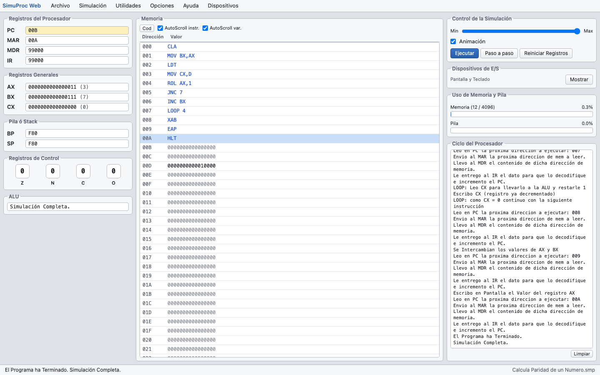

# SimuProc Web

Reimplementación para el navegador de **SimuProc 1.4.3.0**, el simulador de un procesador hipotético de 16 bits escrito por Vladimir Yepes Bedoya ("Vlaye", 2000–2004) que se usa en el ramo *Arquitectura de Computadores* (UCN). El original es un ejecutable de Windows; esta versión corre en cualquier navegador moderno, en macOS, Linux y Windows, sin instalar nada.

- **URL pública**: <https://simuproc-web.vercel.app>.
- Todo se ejecuta en el navegador: no hay servidor ni llamadas de red en tiempo de ejecución.



## Qué incluye

- Las 53 instrucciones de SimuProc 1.4.3.0 (LDA … HLT, incluidas las de punto flotante IEEE 754 y los puertos 1, 8, 9 y 13) con la semántica documentada en la especificación del curso y en la ayuda del original.
- Memoria de 4096 posiciones (000–FFF), registros AX/BX/CX, PC, MAR, MDR, IR, BP/SP, flags Z/N/C/O (doble clic, o Enter/Espacio con el foco, para forzar su valor), pila, indicadores de uso de memoria y pila, y el registro de micro-pasos del ciclo fetch/execute con los textos del original.
- `Dispositivos de E/S`: monitor, teclado en modo Decimal o Binario (o real para `IN registro,1`) y `Último Dato`.
- `Editor Interno` con `Editor 1 (Tipo Memoria)` y `Editor 2 (De Texto)`, conversión en ambos sentidos, envío a memoria, resaltado de sintaxis, menú contextual `Agregar Instrucción` y `Programas de Ejemplo` con tres grupos: los 6 ejemplos incrustados en el original, los 17 programas del profesor y los 2 programas `.smp` oficiales.
- Abrir y guardar programas `.smp` (formato nativo del original), `.asm` y `.txt` (formato del Editor 2). Al abrir se acepta UTF-8 o CP1252; los archivos `.asm` se escriben en CP1252 con CRLF para que el SimuProc original de Windows los abra.
- `Modificar una Posición de Memoria` (también con doble clic sobre una fila de la memoria), `Reiniciar Registros`, `Paso a paso` (no existe en el original), `Ayuda › Instrucciones soportadas` y `Acerca de`.

## Ejecutar en local

Requiere Node.js 22.12 o superior (Vitest no admite las versiones impares 23 y 25; ver `engines` en `package.json` y `.nvmrc`).

```bash
npm install && npm run dev
```

Abre `http://localhost:5173`. Para una compilación de producción: `npm run build` y `npm run preview`.

## Cómo usarlo

1. **Cargar un programa**: `Utilidades › Editor Interno…` y luego `Programas de Ejemplo` (o `Cargar un programa desde un archivo` para un `.asm`/`.txt` propio). También `Archivo › Abrir Programa…` abre `.smp`, `.asm` y `.txt` directamente en memoria.
2. **Enviar a memoria**: en el Editor 2 pulsa `Convertir a Editor 1`; en el Editor 1 revisa las direcciones (los saltos usan direcciones absolutas) y pulsa `Enviar a Memoria`.
3. **Ejecutar**: en la ventana principal pulsa `Ejecutar` (o `Paso a paso`). Cuando el programa pide un dato (`LDT` o `IN registro,1`) se abre `Dispositivos de E/S`: escribe el valor y pulsa `Entrar Dato`.
   - Modo **Decimal**: enteros 0–65535. Modo **Binario**: hasta 16 dígitos de 0 y 1. Para `IN registro,1` se pide un número real (negativos y decimales permitidos, con punto o coma).
4. **Velocidad y animación**: el deslizador va de unos 2 s por instrucción a "lo más rápido posible". Con `Animación` desactivada no hay resaltados ni micro-pasos y la ejecución es mucho más rápida; `Pausar` funciona incluso dentro de un bucle infinito.
5. **Guardar**: `Archivo › Guardar Programa Como…` descarga el programa en memoria como `.smp` o como texto `.asm`. El navegador lo deja en la carpeta de descargas.

## Los programas del profesor

Los 17 archivos de `Ejemplos del curso` se cargan sin errores. Ojo con los datos de más de 16 dígitos binarios: cada posición guarda 16 bits, así que el editor lo marca como error con un aviso que explica cómo dividirlo en dos posiciones. `leedat.asm` usa datos decimales (`20`, `30`, `128`…), que el original solo acepta en binario: aquí se aceptan con un aviso. `ejemplo6.asm` tiene un error propio (`sta 0f` sobrescribe su `hlt`) que se reproduce tal cual; `ejemplo2026_3.txt` es la versión corregida.

## Diferencias con el original

Varios detalles del original no están documentados (dividendo de `DIV`, flags exactos de cada instrucción, sentido de crecimiento de la pila, línea 3 del formato `.smp`, etc.). Cada decisión, su evidencia y un programa corto para confirmarla en el SimuProc original están en [`docs/fidelidad.md`](docs/fidelidad.md). Además:

- El menú `Ver` del original (siempre visible, barra de herramientas, barra de estado) no existe.
- `Paso a paso` es una adición; `Ejecutar` después de un `HLT` reinicia los registros automáticamente.
- Utilidades de la segunda fase: `Conversión de bases` (decimal, binario, hexadecimal, octal, otra base 2–36, Ascii y desglose IEEE 754 de 32 bits, con lectura de un número real desde la memoria), `Entrada de Instrucciones Manualmente` (con los mensajes de validación del original), `Estadísticas de la Simulación`, `Vigilante de Memoria` (hasta 6 posiciones, historial de 5 valores, pausa al cambiar o al igualar un valor), `Switches - Puerto 9`, `PC Speaker` (puerto 13, sonido por WebAudio) y `Configurar SimuProc` (colores de la animación, autoscroll, líneas del monitor, decimales de los flotantes, editar memoria directamente, ignorar instrucciones no reconocidas, resetear estadísticas, mostrar instrucción o código). La interfaz sigue el modo claro u oscuro del sistema.

## Desarrollo

```bash
npm run lint                     # oxlint
npm test                         # tests unitarios, de programas, de formatos, del store y de la UI (Vitest)
npx playwright install chromium  # una vez, antes de los tests e2e
npm run test:e2e                 # build + tests funcionales en Chromium (Playwright)
npm run screenshots              # los mismos tests e2e, y además regenera docs/screenshots/*.png
npm run build                    # tsc + vite build
```

`npm run test:e2e` no escribe capturas; solo `npm run screenshots` actualiza `docs/screenshots/` (equivale a `DOC_SCREENSHOTS=1 npx playwright test`). Playwright compila la app y la sirve con `vite preview` en el puerto 4173 antes de los tests; en local, si ya hay un servidor en ese puerto lo reutiliza tal cual, así que conviene detenerlo para probar el código actual.

- `src/core/`: simulador puro en TypeScript (sin React ni DOM): memoria de celdas de texto, decodificador, CPU, dispositivos inyectables, runner, ensamblador del Editor 2, codec `.smp` y codificación CP1252.
- `src/state/`: store de la aplicación (`useSyncExternalStore`).
- `src/platform/`: acceso al navegador para abrir y descargar archivos, y el sonido del PC Speaker (WebAudio).
- `src/ui/`: ventana principal, ventanas flotantes y diálogos.
- `src/ejemplos/`: programas de ejemplo empaquetados en tiempo de compilación (`simuproc/`, `curso/` y `smp/`).
- `reference/`: material del SimuProc original (solo lectura), índice en `reference/README.md`.
- `tests/`: `core/` (instrucciones con los ejemplos de la especificación, los 25 programas de ejemplo con entradas guionizadas, teclado, entrada manual, conversión de bases y runner), `formats/`, `state/`, `ui/` y `e2e/` (Playwright).

## Publicar

La app es estática: `npm run build` deja el sitio en `dist/`, que se puede servir desde cualquier hosting estático.

## Créditos

SimuProc es obra de **Vladimir Yepes Bedoya** ("Vlaye"), 2000–2004, freeware que "puede ser distribuido libremente"; sitios originales: <http://simuproc.cjb.net> y <http://simuproc.tk/>. SimuProc Web es una reimplementación independiente, sin afiliación con el autor original, que reutiliza sus textos, su lista de instrucciones y sus programas de ejemplo con fines educativos. Los programas de `Ejemplos del curso` son del profesor del ramo. El detalle está en [`NOTICE.md`](NOTICE.md).

## Licencia

El código de SimuProc Web está bajo la licencia [MIT](LICENSE). El material de terceros (textos, ayuda y programas del SimuProc original, y los programas del curso) no está cubierto por esa licencia: ver [`NOTICE.md`](NOTICE.md).
